# Munim-AI

**WhatsApp-first GST compliance co-pilot for Indian MSMEs**


> Traders forward invoices via WhatsApp. Munim extracts, validates, fraud-checks, and reconciles them automatically. CAs get a clean action-driven dashboard instead of a pile of paper.

---

## What Munim-AI Does

A CA managing GST compliance for MSME clients today reconciles once a month, in a
deadline rush, after the window to fix a supplier's mistake has already closed. Munim
flips that: every invoice is checked **the moment it arrives** — extracted from a
WhatsApp photo, validated against GST Act rules, fraud-scored, and reconciled against
GSTR-2B — so the CA (and the trader) knows about a blocked credit or a fraudulent
supplier weeks before the filing deadline, not on it.

- **No app to install.** Traders send invoices as WhatsApp photos; onboarding takes under 2 minutes.
- **Deterministic compliance logic.** GST Act §16/§17(5) eligibility, HSN validation, and GSTR-2B reconciliation are pure rule-based code — the LLM only does OCR and plain-language explanation, never the compliance decision itself.
- **Fraud detection nobody runs by hand.** A 6-signal scorer (Benford's Law, sequential invoicing, velocity anomalies, and more) flags fake-invoice patterns a CA charging ₹1,000/month has no time to check manually.
- **One CA, unlimited clients.** A single multi-tenant dashboard ranks every client's open issues by money at risk, so the CA always works the highest-value problem first.
- **It automates the paperwork, not the judgment call.** Representation before tax authorities and legal interpretation stay with the CA — that boundary is deliberate, not a limitation.
- **Built for scale, not a niche.** India has an estimated 6.3+ crore MSMEs and only ~1.4 crore GST-registered businesses with any real CA relationship today — the rest are priced out of compliance help entirely. A WhatsApp-first product, not an app they have to download, is the realistic way to reach the crores of Indian shopkeepers and small manufacturers this actually affects.

The rest of this README covers the feature list, tech stack, and architecture in
detail — see below.

---

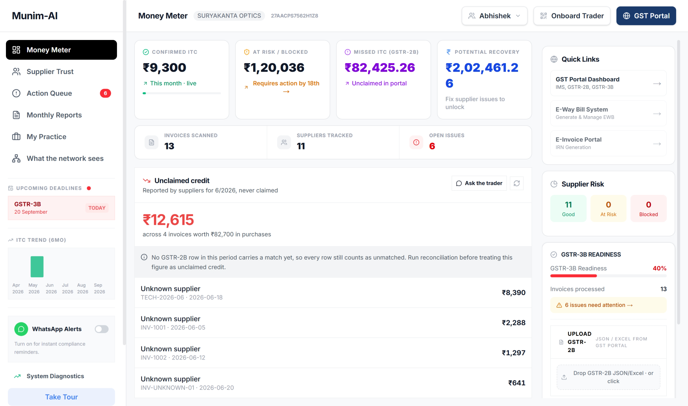
*Money Meter: the CA's home screen — confirmed ITC, blocked credit, and unclaimed recovery, live.*

---

## Core USPs

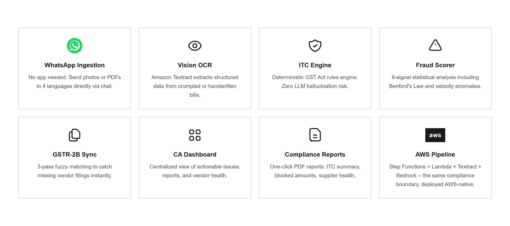

### 1. WhatsApp-First — Zero App Download
- Traders interact entirely via WhatsApp in their language (Hindi, English, Marathi, Gujarati)
- Conversational onboarding in under 2 minutes
- Each trader gets a dedicated Munim email address for vendors who prefer email over WhatsApp

### 2. Multimodal AI Extraction (Gemini 2.5 Flash)
- Handles crumpled thermal receipts, handwritten bills, scanned PDFs, blurry photos
- Outputs structured JSON: supplier name, GSTIN, invoice number, date, line items, HSN codes, tax breakdown
- Low-confidence extractions are flagged for human review

### 3. Deterministic ITC Rules Engine — No LLM
- Pure rule-based GST Act §16 + §17(5) implementation
- Classifies every invoice into: `CONFIRMED` / `FIXABLE_BLOCKED` / `AT_RISK` / `INELIGIBLE` / `FRAUD_FLAGGED`
- 12+ blocked categories covered by HSN prefix and keyword matching (motor vehicles, accommodation, outdoor catering, health clubs, personal consumption, real estate, etc.)
- Zero hallucination risk — fully auditable logic

### 4. 6-Signal Fraud Scoring Engine (0–100)

| Signal | What It Detects |
|---|---|
| GSTIN Age | New GSTIN (<180 days) issuing high-value invoices |
| Benford's Law | Unnatural leading-digit distribution (chi-squared test) |
| Sequential Invoice Numbers | Consecutive serials from same supplier — classic fake invoice pattern |
| Business Type Mismatch | GSTIN registration category contradicts invoice line items |
| Geographic Mismatch | Supplier state ≠ buyer state without IGST |
| Velocity Anomaly | Invoice amount >5× the supplier's historical average |

Score ≥ 70 → `FRAUD_FLAGGED`. Score 40–69 → soft flag for CA review.

### 5. GSTR-2B Three-Pass Fuzzy Reconciliation
- **Pass 1 — Exact:** GSTIN + invoice number + date all match
- **Pass 2 — Fuzzy:** Levenshtein distance on invoice number (`INV-001` vs `INV001`), ±2% amount tolerance, ±15-day date window
- **Pass 3 — Amount + Date:** Fallback when invoice number is ambiguous
- Unmatched invoices surface instantly in Action Queue with vendor contact options

### 6. Prioritized Action Queue
- All issues across all clients ranked: fraud flags → ITC-at-risk → fixable blocks
- Each item shows the exact reason, affected tax amount, and recommended fix
- One-click WhatsApp or email vendor warning sent directly from the dashboard

### 7. Supplier Health Monitoring
- Tracks each vendor's GSTR-1 filing consistency across months
- Flags chronically non-compliant suppliers before they become a problem

### 8. Email Invoice Ingestion (Cloudmailin)
- Traders share their dedicated Munim email with vendors
- Vendor emails PDFs → Cloudmailin webhook → same Gemini pipeline → auto-added to records

### 9. Auto-Generated Compliance Reports
- One-click PDF per trader per period
- Covers ITC summary, blocked amounts, at-risk credits, reconciliation status, supplier health

### 10. GST Portal Simulation
- Interactive IMS (Invoice Management System) + GSTR-3B auto-draft
- Populated from live backend data — context-aware per selected trader
- Mirrors the real GST portal UI for demo and training purposes

### 11. Real-Time Compliance Timeline
- Visual deadline calendar: GSTR-1, GSTR-2B upload, GSTR-3B filing dates
- Proactive WhatsApp reminders before each deadline

### 12. Multi-Tenant CA Dashboard
- One CA manages unlimited traders from a single login
- Instant client switching, fully isolated per trader data
- Built as a PWA — works on mobile without installation

### 13. Cross-Tenant Network Intelligence
- Aggregates how a supplier behaves across *every* business Munim monitors, not just one CA's client
- A supplier flagged risky by one CA's client sharpens the signal for every other CA watching the same GSTIN
- Strictly aggregate-only — a business never sees another business's invoices, amounts, or identity, only counts
- Requires a minimum of 3 businesses tracking a supplier before it reports a pattern, to avoid leaking a single client's data through the aggregate

---

## Product Walkthrough

The screenshots below are the live, deployed app — not mockups.

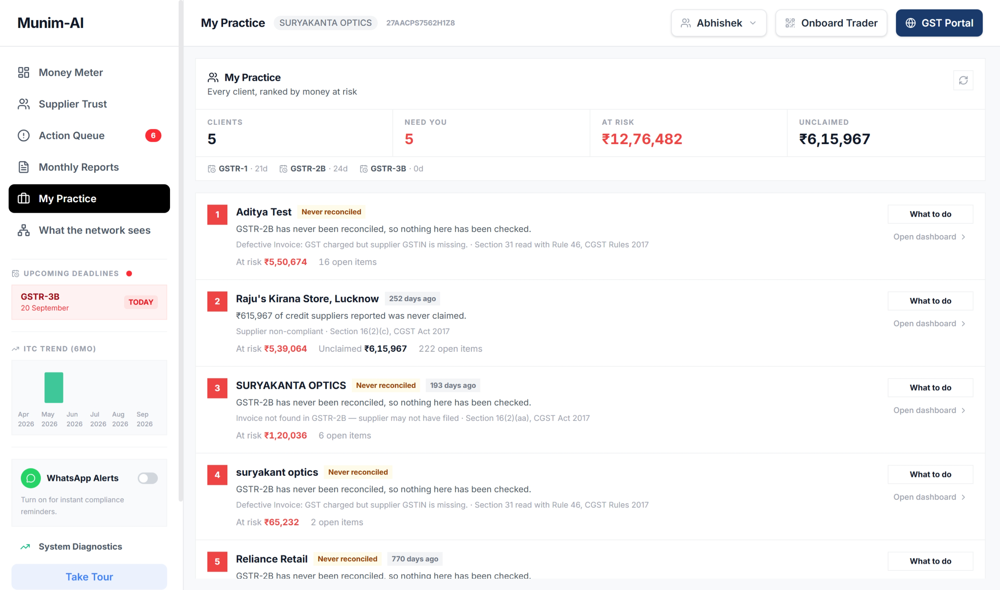
*My Practice — the CA's full client list, each one flagged by reconciliation status and money at risk.*

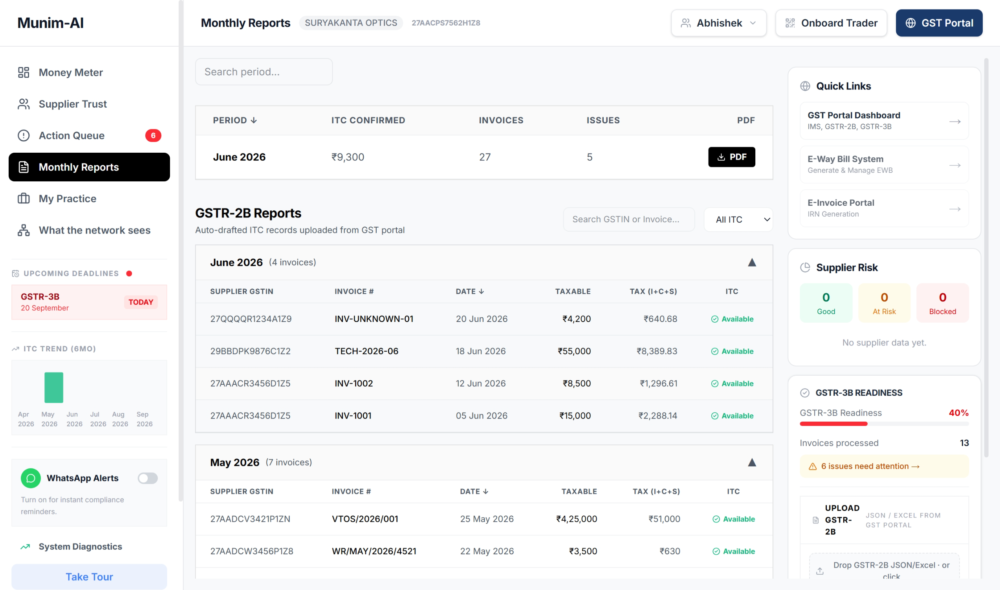
*Monthly Reports — period-by-period GSTR-2B records, one-click PDF export, GSTR-3B readiness score.*

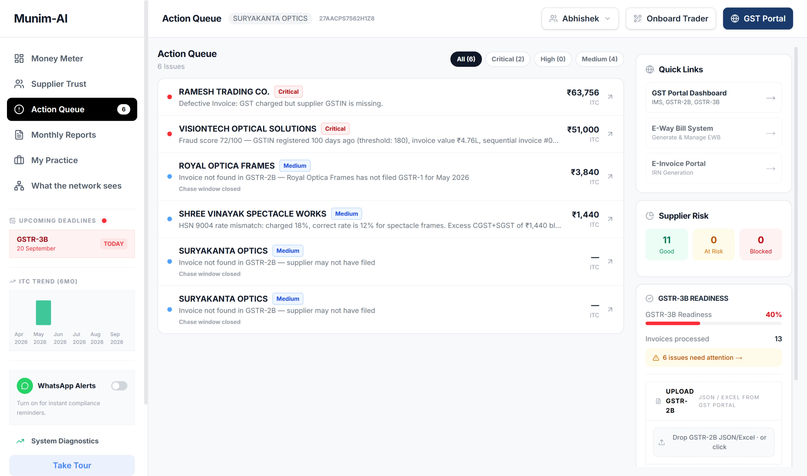
*Action Queue — every open issue across every client, ranked Critical → Medium, each with the exact ITC amount at stake.*

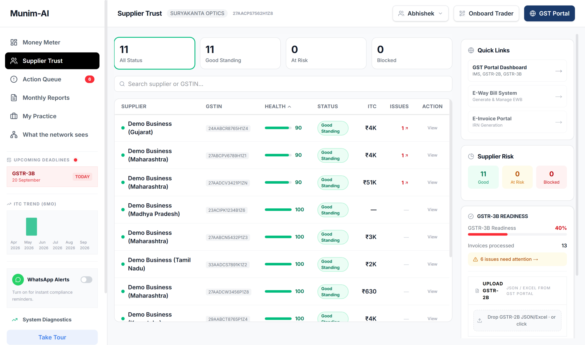
*Supplier Trust — every vendor's GSTR-1 filing health, so a supplier going bad is caught before it blocks ITC.*

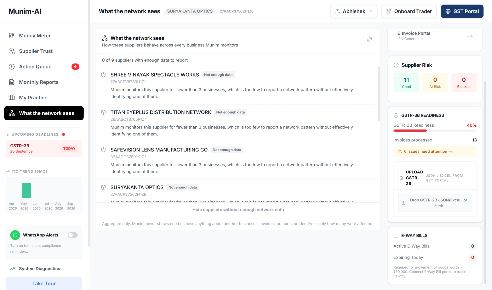
*What the Network Sees — Core USP #13 above, live: aggregate-only supplier behavior pooled across every business Munim monitors.*

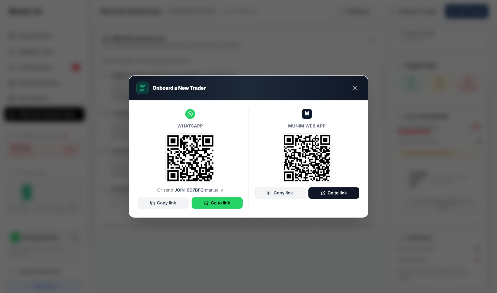
*Onboarding — a CA adds a new trader with a single QR code, over WhatsApp or the web app.*

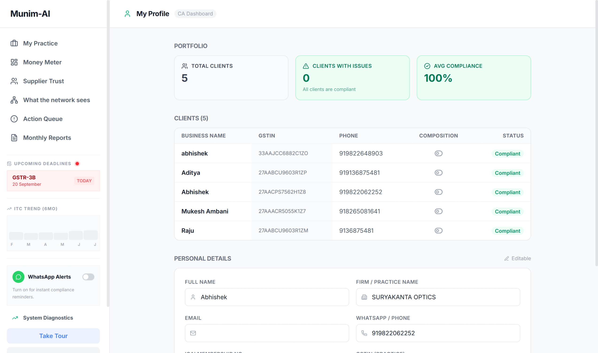
*My Profile — the CA's practice details and client roster in one place.*

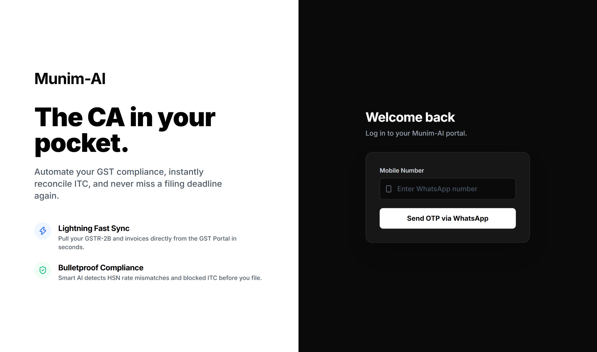
*Login — WhatsApp OTP only. No password, no app store.*

---

## Tech Stack

| Layer | Technology |
|---|---|
| Backend | FastAPI, LangGraph, Python 3.12, Uvicorn |
| Frontend | Next.js 16 (App Router), React 19, Tailwind CSS |
| Database | Supabase (PostgreSQL) — multi-tenant isolation enforced app-layer, not via RLS |
| AI / LLM | Google Gemini 2.5 Flash (Vision + Text) |
| Messaging | Meta WhatsApp Cloud API |
| Email Ingestion | Cloudmailin |
| Cache / Sessions | Redis (Upstash) |
| GSTIN Validation | deepvue.tech API |
| Fuzzy Matching | python-Levenshtein |
| PDF Generation | WeasyPrint |
| Deployment (this submission) | Backend on Google Cloud Run, frontend on **AWS App Runner** — see [Live Deployment](#live-deployment) below. Full AWS-native pipeline (Step Functions, Lambda, Textract, Bedrock, DynamoDB) in [`aws/`](aws/README.md) |

---

## Architecture

Generated directly from the real code structure — every box names the actual file behind it.

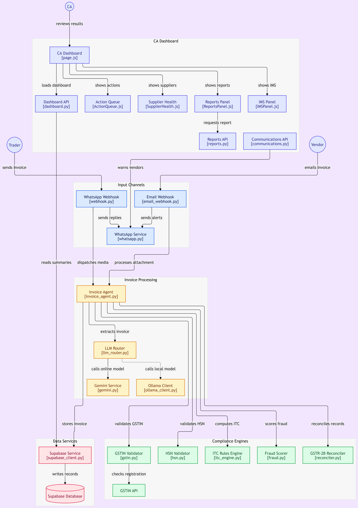

```
Trader (WhatsApp / Email)                              Vendor (Email)
         │                                                    │
         ▼                                                    ▼
Meta Cloud API / Cloudmailin Webhook ──────────────────────────
         │
         ▼
FastAPI Backend (Google Cloud Run)
         │
    LangGraph Pipeline
    ├── 1. Gemini Vision OCR → InvoiceJSON
    ├── 2. GSTIN Validator (deepvue.tech)
    ├── 3. HSN Validator (pgvector + Supabase)
    ├── 4. ITC Rules Engine   ← no LLM
    ├── 5. Fraud Scorer       ← no LLM
    └── 6. GSTR-2B Reconciler ← no LLM
         │
         ▼
Supabase PostgreSQL
    ├── CA Dashboard (Next.js, deployed to AWS App Runner for this submission)
    │     ├── Action Queue
    │     ├── Supplier Health
    │     ├── Reports Panel
    │     └── GST Simulation
    └── Redis (session state / conversation context)
```

### AWS Architecture

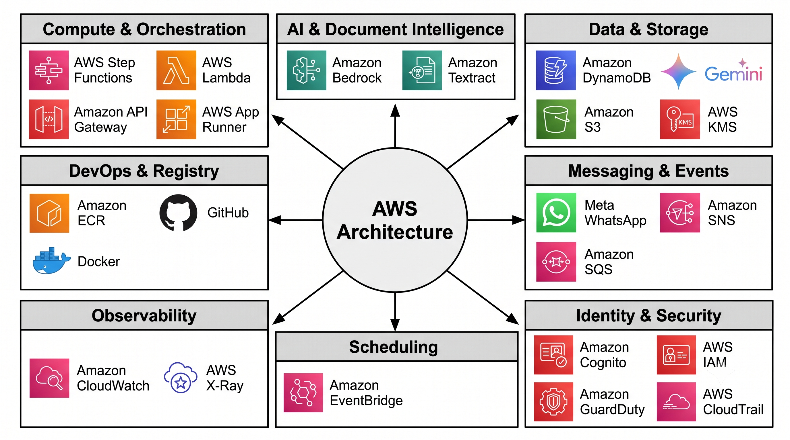

The `aws/` directory is a separate, parallel build of this same product's
invoice pipeline — Step Functions, Lambda, Textract, Bedrock, DynamoDB,
API Gateway, Cognito, and more. **See [`aws/README.md`](aws/README.md)**
for the full service breakdown and how each Lambda maps to the pipeline
above.

---

## Project Structure

```
munim/
├── aws/                            # This submission's AWS build
│   ├── lambdas/                    # ingest, extract, compute_verdict,
│   │                               # explain, finalize, meta_webhook,
│   │                               # voice_handler, bedrock_healthcheck
│   ├── state-machine.json          # Step Functions definition
│   └── README.md                   # AWS architecture + service breakdown
├── backend/
│   ├── app/
│   │   ├── api/
│   │   │   ├── webhook.py          # WhatsApp bot + onboarding
│   │   │   ├── dashboard.py        # CA dashboard endpoints
│   │   │   ├── gstr2b.py           # GSTR-2B upload + reconciliation
│   │   │   ├── reports.py          # PDF generation
│   │   │   ├── communications.py   # Vendor WhatsApp/email warnings
│   │   │   ├── email_webhook.py    # Cloudmailin ingestion
│   │   │   └── auth.py             # JWT auth
│   │   ├── domain/
│   │   │   ├── itc_engine.py       # GST §16/§17(5) rules
│   │   │   ├── fraud.py            # 6-signal fraud scorer
│   │   │   ├── reconciler.py       # 3-pass GSTR-2B reconciler
│   │   │   ├── hsn.py              # HSN validator
│   │   │   ├── supplier_monitor.py # Supplier health scoring
│   │   │   └── network_intel.py    # Cross-tenant supplier intelligence
│   │   ├── models/                 # Pydantic data models
│   │   └── services/               # Supabase, WhatsApp, Gemini clients
│   └── requirements.txt
├── frontend/
│   ├── src/app/
│   │   ├── dashboard/              # CA main dashboard
│   │   ├── trader/                 # Trader PWA
│   │   ├── aws-pipeline/           # Live view onto the AWS pipeline's
│   │   │                           # own DynamoDB data
│   │   └── components/             # Shared UI components
│   └── public/demo/                # GST simulation (standalone HTML/JS)
└── gst-portal-automation/          # GST portal automation scripts (not tracked)
```

---

## API Reference

| Endpoint | Method | Description |
|---|---|---|
| `/api/v1/webhook` | GET/POST | WhatsApp webhook (verify + message handling) |
| `/api/v1/webhook/upload-invoice` | POST | Direct upload from Trader PWA |
| `/api/v1/email-webhook` | POST | Cloudmailin inbound email → pipeline |
| `/api/v1/dashboard/summary/{trader_id}` | GET | ITC summary card data |
| `/api/v1/dashboard/actions/{trader_id}` | GET | Prioritized action queue |
| `/api/v1/dashboard/actions/{id}/resolve` | PATCH | Mark action resolved |
| `/api/v1/dashboard/suppliers/{trader_id}` | GET | Supplier health list |
| `/api/v1/dashboard/invoices/{trader_id}` | GET | Invoice records + filters |
| `/api/v1/dashboard/itc-timeline/{trader_id}` | GET | 6-month ITC chart data |
| `/api/v1/dashboard/reports/generate/{trader_id}` | POST | Generate PDF report |
| `/api/v1/gstr2b/upload-file/{trader_id}` | POST | Upload GSTR-2B JSON |
| `/api/v1/gstr2b/reconcile/{trader_id}` | POST | Trigger reconciliation run |
| `/api/v1/gstr2b/records/{trader_id}` | GET | Fetch GSTR-2B records |

---

## Live Deployment

This is a deployed, finished submission — not a local dev project.

- **Frontend (AWS App Runner):** https://eym73fepx3.ap-south-1.awsapprunner.com
- **Live AWS pipeline view:** https://eym73fepx3.ap-south-1.awsapprunner.com/aws-pipeline
  — reads real data straight off the Step Functions pipeline's own DynamoDB table.

### AWS Deployment
The `aws/` build deploys straight to AWS — Step Functions, Lambda, API
Gateway, DynamoDB, App Runner. See [`aws/README.md`](aws/README.md) and
the per-component docs in `aws/*.md` (state machine, API Gateway,
EventBridge, App Runner) for the exact `aws`/`docker` CLI commands used
to stand each piece up.

---

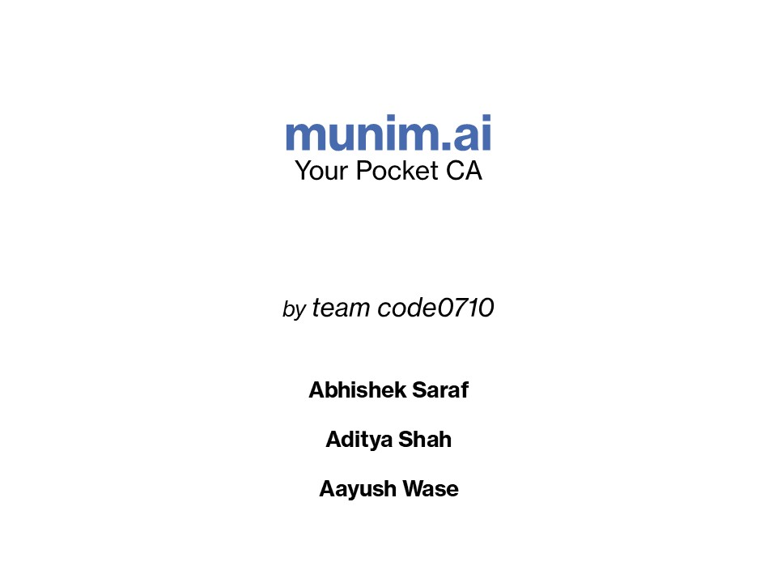

---

*See LICENSE.*
